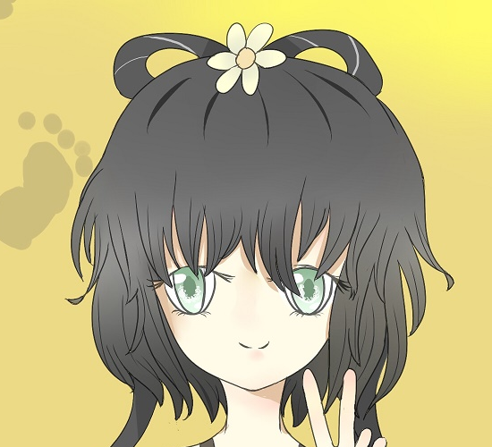
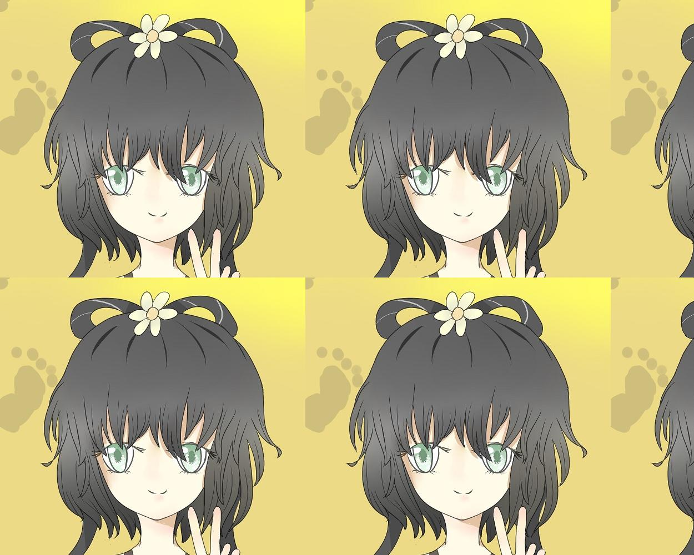
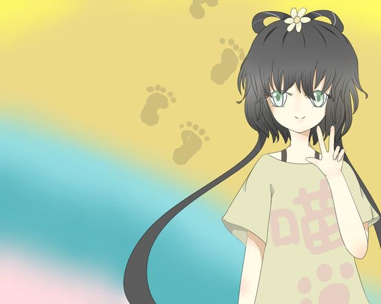
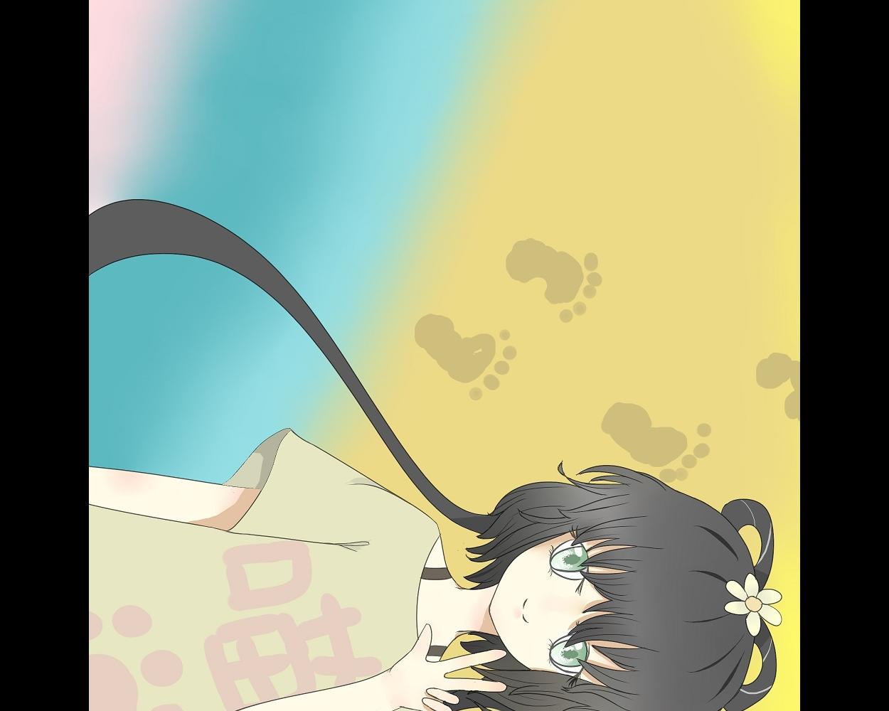
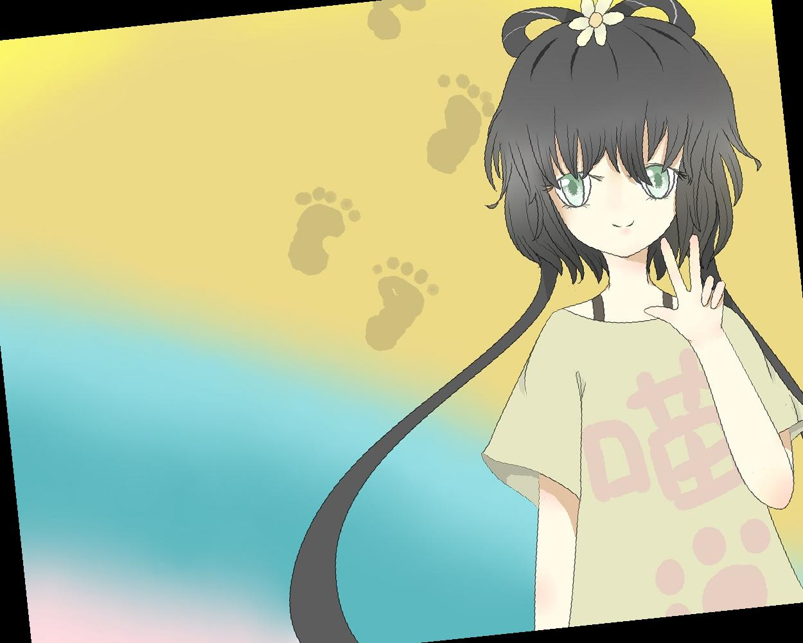
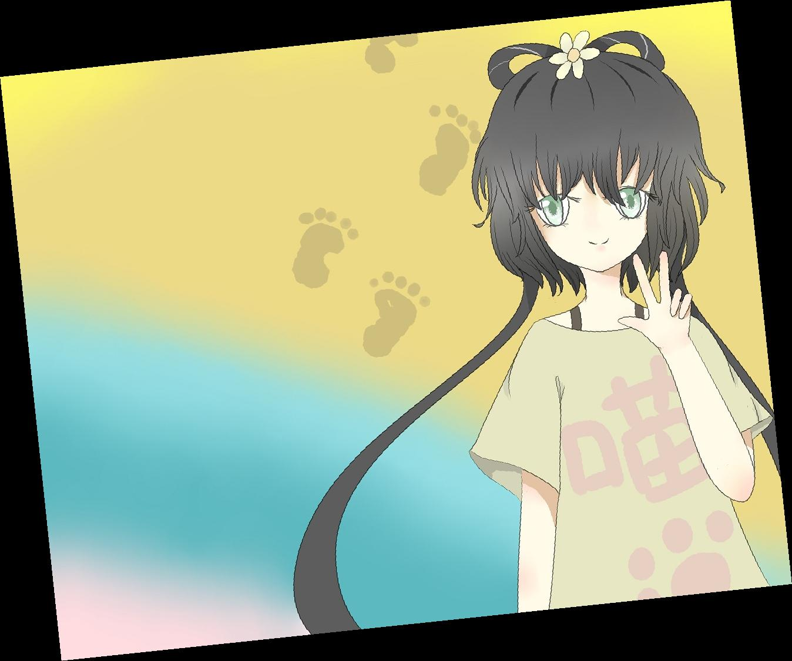
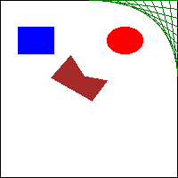
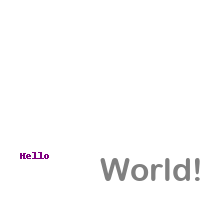

```{r style, echo=FALSE, results="asis", message=FALSE}
knitr::opts_chunk$set(tidy = FALSE,
		   message = FALSE)
```


> 这一章我们来学习下Python的图像处理。

Pillow 是一个第三方 Python模块，用于处理图像文件。该模块包含一些函数，可以很容易地裁剪图像、调整图像大小，以及编辑图像的内容。从而使我们可自动以编辑编辑成千上万的图像，或者你也可以用PS脚本、Xnconvert等等。

PIL：保持与老模块 Python Imaging Library 向后兼容

## 颜色

先参考一下这个网址：https://color.adobe.com/create/color-wheel/

相信你已经学会饿了颜色的基础理论，那我们直接用pillow来进行简单的颜色处理吧。

RGBA值表示为四个整数值的元组。例如：红色不透明表示为（255，0，0，255）。


```{python}
from PIL import ImageColor 

```

```{python eval=FALSE}
ImageColor.getcolor('red', 'RGBA') 
# (255, 0, 0, 255)
ImageColor.getcolor('Purple', 'RGBA') 
# (128, 0, 128, 255) 
ImageColor.getcolor('chocolate', 'RGBA') 
# (210, 105, 30, 255)
```

单个像素的颜色可以通过 getpixel()和 putpixel()方法取得和设置。它们都接受一个元组，表示像素的x和y坐标。putpixel()方法还接受一个元组，作为该像素的颜色。
```{python}
from PIL import Image 
im = Image.new('RGBA', (100, 100)) ## transparent square
# im.getpixel((0, 0)) 
## (0, 0, 0, 0) 
for x in range(100): 
  for y in range(50): 
    im.putpixel((x, y), (210, 210, 210)) 
 
from PIL import ImageColor 
for x in range(100): 
  for y in range(50, 100): 
    im.putpixel((x, y), ImageColor.getcolor('darkgray', 'RGBA')) 
#im.getpixel((0, 0)) 
## (210, 210, 210, 255) 
#im.getpixel((0, 50)) 
## (169, 169, 169, 255) 
im.save('putPixel.png') 
```


## 用Pillow操作图像 

要加载图像，就要从 Pillow模块中导入Image 模块，并调用 `Image.open()`，传入图像的文件名。


```{python}
from PIL import Image 
Im = Image.open('demo.jpg') 
width, height = Im.size
#Im.size
## (1250, 1000)
#Im.filename
## 'demo.jpg'
#Im.format
## 'JPEG'
#Im.format_description
## 'JPEG (ISO 10918)'
Im.save('demo.png') ## save as jpg format
```

Pillow还提供了Image.new()函数用来创建一个空白的图像用于后续的图像处理，这里我们创建了一个带有紫色背景的图像和一个透明背景的小方块。

```{python}
from PIL import Image 
im = Image.new('RGBA', (100, 200), 'purple') 
im.save('purpleImage.png') 
im2 = Image.new('RGBA', (20, 20)) 
im2.save('transparentImage.png') 

```
通过crop()方法，可进行一下图像裁剪,我们凭感觉找一下头的位置。
```{python}
faceIm = Im.crop((700, 0, 1250, 500)) 
faceIm.save('cropped.png') 
```

copy()方法用于复制一个新的和原来一模一样的图像，paste()方法在 Image 对象调用，将另一个图像粘贴在它上面，或者说加一个图层。
```{python}
Imwidth, Imheight = Im.size
faceImWidth, faceImHeight = faceIm.size
Im2 = Im.copy() 
for left in range(0, Imwidth, faceImWidth): 
  for top in range(0, Imheight, faceImHeight): 
    print(left, top) 
    Im2.paste(faceIm, (left, top)) 
Im2.save('tiled.jpg') 
```



resize()方法在Image对象上调用，返回指定宽度和高度的一个新Image对象。
```{python}
quartersizedIm = Im.resize((int(Imwidth / 2), int(Imheight / 2))) 
quartersizedIm.save('quartersized.jpg') 
svelteIm = Im.resize((Imwidth, Imheight + 300)) 
svelteIm.save('svelte.jpg') 
```
 

图像可以用 rotate()方法旋转，该方法返回旋转后的新 Image 对象，并保持原始Image 对象不变。
```{python}
Im.rotate(270).save('rotated270.jpg') 
```

注意，当图像旋转 90 度或 270 度时，宽度和高度会变化。如果旋转其他角度，图像的原始尺寸会保持。在 Windows 上，使用黑色的背景来填补旋转造成的缝隙。在 OS X 上，使用透明的像素来填补缝隙。

```{python}
Im.rotate(6).save('rotated6.jpg') 
Im.rotate(6, expand=True).save('rotated6_expanded.jpg') 
```
 

利用 transpose()方法，还可以得到图像的“镜像翻转”
```{python}
Im.transpose(Image.FLIP_LEFT_RIGHT).save('horizontal_flip.jpg') 
Im.transpose(Image.FLIP_TOP_BOTTOM).save('vertical_flip.jpg') 
```
 

##  在图像上绘画 

如果需要在图像上画线、矩形、圆形或其他简单形状，就用 Pillow 的 ImageDraw 模块。
```{python}
from PIL import Image, ImageDraw 
im = Image.new('RGBA', (200, 200), 'white') 
draw = ImageDraw.Draw(im) 
```
**绘制形状**


| 形状   | 这些方法的 fill 和 outline 参数是可选的，如果未指定，默认为白色 |
| ------ | ------------------------------------------------------------ |
| 点     | point(xy, fill)方法绘制单个像素。xy 参数表示要画的点的列表。该列表可以是 x和 y 坐标的元组的列表，例如[(x, y), (x, y), ...]，或是没有元组的 x 和 y 坐标的列表，例如[x1, y1, x2, y2, ...]。fill 参数是点的颜色，要么是一个 RGBA 元组，要么是颜色名称的字符串，如'red'。fill 参数是可选的。 |
| 线     | line(xy, fill, width)方法绘制一条线或一系列的线。xy 要么是一个元组的列表，例如[(x, y), (x, y), ...]，要么是一个整数列表，例如[x1, y1, x2, y2, ...]。每个点都是正在绘制的线上的一个连接点。可选的 fill 参数是线的颜色，是一个 RGBA 元组或颜色名称。可选的 width 参数是线的宽度，如果未指定，缺省值为 1。 |
| 矩形   | rectangle(xy, fill, outline)方法绘制一个矩形。xy 参数是一个矩形元组，形式为(left, top, right, bottom)。left 和 top 值指定了矩形左上角的 x 和 y 坐标，right 和 bottom 指定了矩形的右下角。可选的 fill 参数是颜色，将填充该矩形的内部。可选的 outline 参数是矩形轮廓的颜色。 |
| 椭圆   | ellipse(xy, fill, outline)方法绘制一个椭圆。如果椭圆的宽度和高度一样，该方法将绘制一个圆。xy 参数是一个矩形元组(left, top, right, bottom)，它表示正好包含该椭圆的矩形。可选的 fill 参数是椭圆内的颜色，可选的 outline 参数是椭圆轮廓的颜色。 |
| 多边形 | polygon(xy, fill, outline)方法绘制任意的多边形。xy 参数是一个元组列表，例如[(x, y), (x, y), ...]，或者是一个整数列表，例如[x1, y1, x2, y2, ...]，表示多边形边的连接点。最后一对坐标将自动连接到第一对坐标。可选的 fill 参数是多边形内部的颜色，可选的 outline 参数是多边形轮廓的颜色。 |

```{python}
from PIL import Image, ImageDraw 
im = Image.new('RGBA', (200, 200), 'white') 
draw = ImageDraw.Draw(im) 
draw.line([(0, 0), (199, 0), (199, 199), (0, 199), (0, 0)], fill='black') 
draw.rectangle((20, 30, 60, 60), fill='blue') 
draw.ellipse((120, 30, 160, 60), fill='red') 
draw.polygon(((57, 87), (79, 62), (94, 85), (120, 90), (103, 113)), 
fill='brown') 
for i in range(100, 200, 10): 
  draw.line([(i, 0), (200, i - 100)], fill='green') 
 
im.save('drawing.png') 
```

ImageDraw 对象还有 text()方法，用于在图像上绘制文本。
text()方法有 4 个参
数：xy、text、fill 和 font。 
•    xy 参数是两个整数的元组，指定文本区域的左上角。 
•    text 参数是想写入的文本字符串。 
•    可选参数 fill 是文本的颜色。 
•    可选参数 font 是一个 ImageFont 对象，用于设置文本的字体和大小。

```{python}
from PIL import Image, ImageDraw, ImageFont 
import os 
im = Image.new('RGBA', (200, 200), 'white')
draw = ImageDraw.Draw(im) 
draw.text((20, 150), 'Hello', fill='purple') 
fontsFolder = 'C:/Windows/Fonts'
myFonts = ImageFont.truetype(os.path.join(fontsFolder, 'ARLRDBD.TTF'), 32) 
draw.text((100, 150), 'World!', fill='gray', font=myFonts) 
im.save('text.png') 
 
```




## REFERENCES

- https://automatetheboringstuff.com/chapter17/
- https://pillow.readthedocs.io/en/latest/reference/ImageDraw.html


